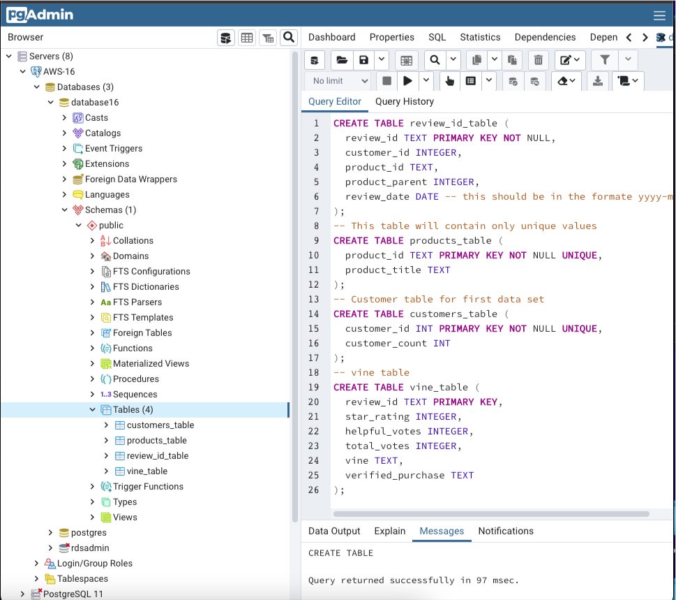
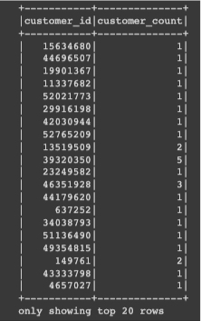
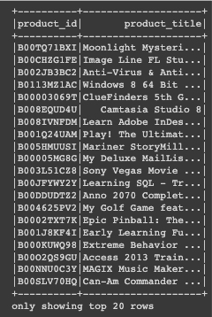
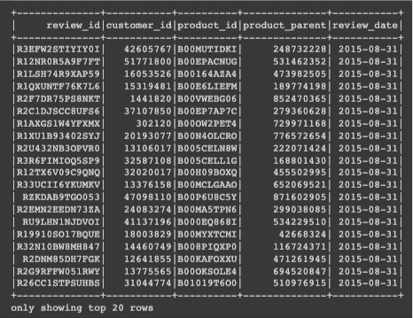
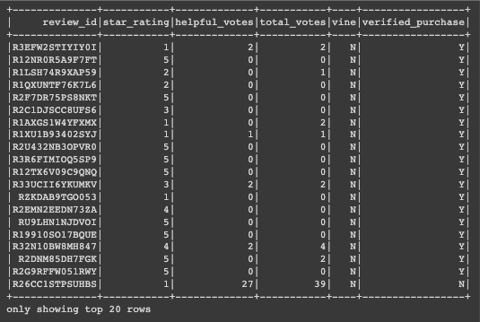
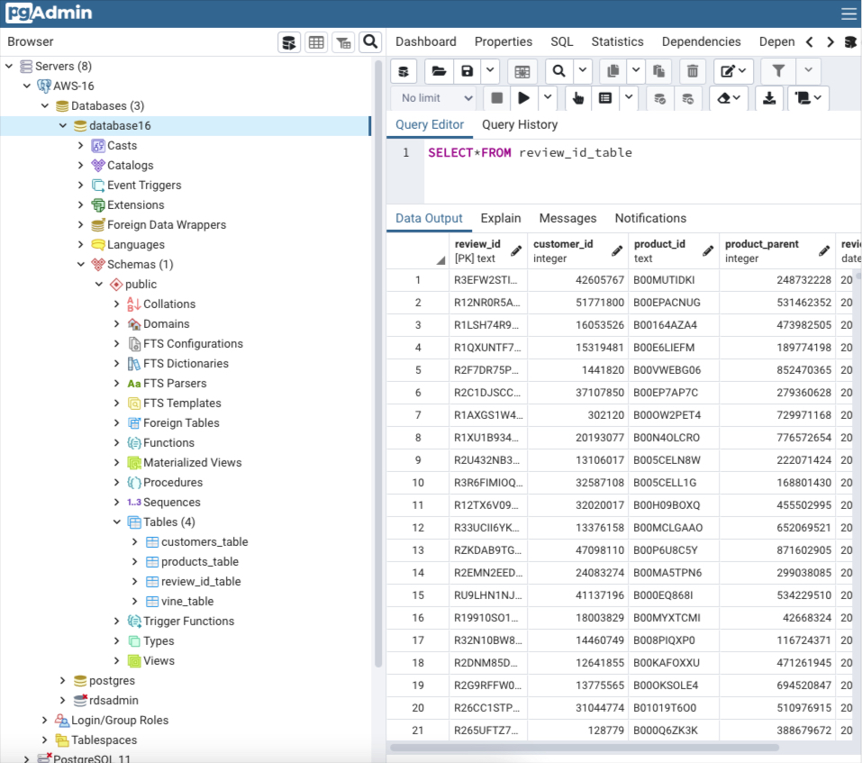
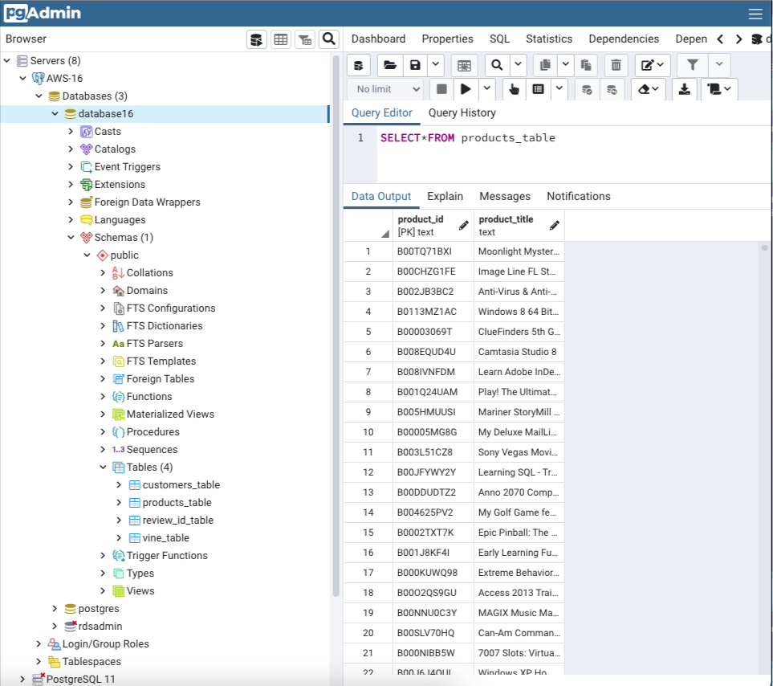
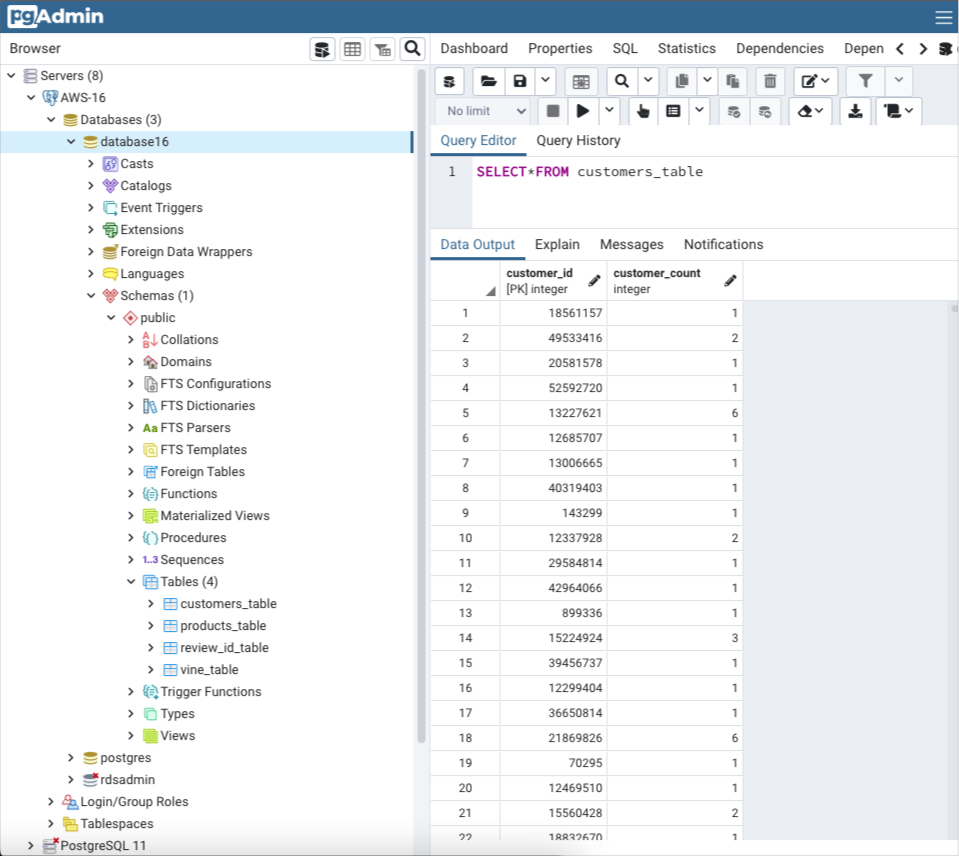
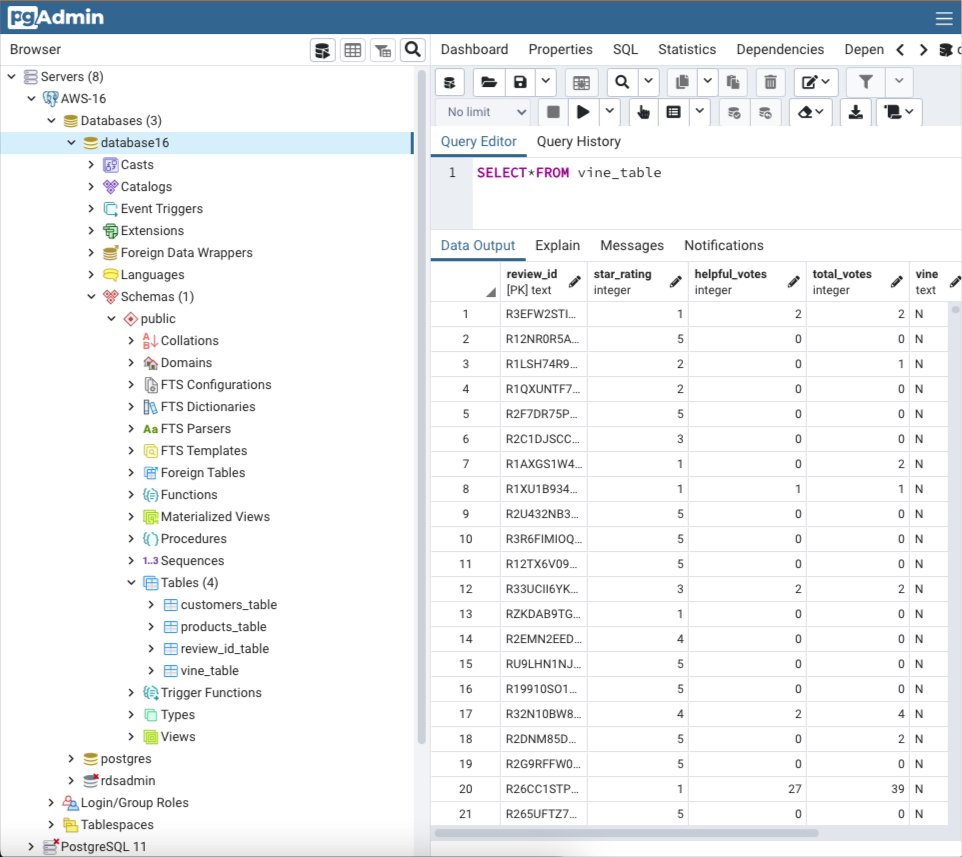
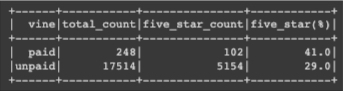

# Amazon_Vine_Analysis
This is a project analyzing Amazon reviews written by members of the paid Amazon Vine program.

## Overview

In this project, I have picked up software products 

> "https://s3.amazonaws.com/amazon-reviews-pds/tsv/amazon_reviews_us_Software_v1_00.tsv.gz"

from approximately 50 datasets 

> "https://s3.amazonaws.com/amazon-reviews-pds/tsv/index.txt

 Each one contains reviews of a specific product, from clothing apparel to wireless products. I have used PySpark to perform the ETL process to extract the dataset, transform the data, connect to an AWS RDS instance, and load the transformed data into pgAdmin. Then, I have used PySpark to determine if there is any bias toward favorable reviews from Vine members in the dataset.

The results are presented and a summary of the analysis has written. 

### Purpuse

The purpuse of the project is to crate four tables which are custenmers, products, Review_id, vine; to apload them in a AWS database by pgAdmin; and to analyse vine table.

## Results

### Perform ETL on Amazon Software Product Reviews

Database named database16 are created in AWS and the scheme of four tables are created in pgAdmin bey the following quiry:

The dataset was extracted by the code

> from pyspark import SparkFiles
>
> url = "https://s3.amazonaws.com/amazon-reviews-pds/tsv/amazon_reviews_us_Software_v1_00.tsv.gz"
> 
> spark.sparkContext.addFile(url)
> 
> df = spark.read.option("encoding", "UTF-8").csv(SparkFiles.get("amazon_reviews_us_Software_v1_00.tsv.gz"), >sep="\t", header=True, inferSchema=True)\

Data frame customers_df was created by the code

> customers_df = df.groupby("customer_id").count().withColumnRenamed("count", "customer_count")

The first 20 rows of the dataframe is given below.

Data frame products_df was created by the code

> products_df = df.select(["product_id","product_title"]).drop_duplicates()

The first 20 rows of the dataframe is given below.

Data frame review_id_df was created by the code

> review_id_df = df.select(["review_id","customer_id","product_id","product_parent", to_date("review_date", 'yyyy-> MM-dd').alias("review_date")])

The first 20 rows of the dataframe is given below.

Data frame vine_df was created by the code

> vine_df = df.select(["review_id","star_rating","helpful_votes","total_votes","vine","verified_purchase"])

The first 20 rows of the dataframe is given below.

I have connect the AWS RDS instance (database16) to load the tables. The code is given below:

> mode = "append"
> 
> jdbc_url="jdbc:postgresql://database16.cjdamamvcehe.us-east-2.rds.amazonaws.com:5432/database16"
> 
> config = {"user":"postgres", 
> 
>          "password": "**********", 
>          
>          "driver":"org.postgresql.Driver"}

Loading  review_id_df to table in RDS, the code is

> review_id_df.write.jdbc(url=jdbc_url, table='review_id_table', mode=mode, properties=config)

And the picture is

Loading  products_df to table in RDS, the code is

> products_df.write.jdbc(url=jdbc_url, table='products_table', mode=mode, properties=config)

And the picture is

Loading  customers_df to table in RDS, the code is

> customers_df.write.jdbc(url=jdbc_url, table='customers_table', mode=mode, properties=config)

And the picture is

Loading  vine_df to table in RDS, the code is

> vine_df.write.jdbc(url=jdbc_url, table='vine_table', mode=mode, properties=config)

And the picture is

You can find the entire code in the link: 

### ghkkghkkhgj

The dataset was extracted by the code

>from pyspark import SparkFiles
>
>url = "https://s3.amazonaws.com/amazon-reviews-pds/tsv/amazon_reviews_us_Software_v1_00.tsv.gz"
>
>spark.sparkContext.addFile(url)
>
>df = spark.read.option("encoding", "UTF-8").csv(SparkFiles.get("amazon_reviews_us_Software_v1_00.tsv.gz"), >sep="\t", header=True, inferSchema=True)

The wine table was created by the code 

> vine_df = df.select(["review_id","star_rating","helpful_votes","total_votes","vine","verified_purchase"])

The dataframe was filtered according to "total_votes" greater than or equal to 20 by the code

> tv_more_20_df=vine_df.filter(vine_df['total_votes']>=20)

The data frame was filtered according to the percentage of "helpful_vote" graeter than or equal to 50 as

> vine_new_1_df=tv_more_20_df.filter(tv_more_20_df["helpful_votes"]/tv_more_20_df['total_votes']>=0.5)

The data frame vine_paid was creted by

> vine_paid_df=vine_new_1_df.filter(vine_new_1_df['vine']=="Y")

The data frame vine_unpaid was created by

> vine_unpaid_df=vine_new_1_df.filter(vine_new_1_df['vine']=="N")

Finally, to find aout bies the following codes were written:

> **The number of paid reviews:**
> 
> paid_count=vine_paid_df.count()

> **The number of unpaid reviews:**
> 
> unpaid_count=vine_unpaid_df.count()
>
> **The number of paid 5-star reviews:**
> 
> five_star_paid_count=vine_paid_df.filter(vine_paid_df["star_rating"]==5).count()
>
> **The number of unpaid 5-star reviews:**
> 
> five_star_unpaid_count=vine_unpaid_df.filter(vine_unpaid_df["star_rating"]==5).count()
>
> **The percentage of paid 5-star reviews:**
> 
> five_star_paid_percent=round(100*five_star_paid_count/paid_count,0)
>
> **The percentage of unpaid 5-star reviews:**
> 
> five_star_unpaid_percent=round(100*five_star_unpaid_count/unpaid_count,0)
>
> **The data frame containing all of the above counts**
>
> counts_df=spark.createDataFrame([('paid',paid_count,five_star_paid_count,five_star_paid_percent),
> 
>                                 ('unpaid',unpaid_count,five_star_unpaid_count,five_star_unpaid_percent)],
>                                 
>                                ['vine','total_count','five_star_count','five_star(%)'])

As a result, there are 248 paid reviews from which 102 of them are 5-star. 5-star reviews are 41 % of the toatal paid reviews. Similarly, there are 17514 upaid reviews from which 5154 of them are 5-star. 5-star reviews are 29 % of the total unpaid reviews.  

These resulsts can be summurized by the following table:

## Summary

Altough the number of paid reviews very very smallar than the number of unpid reviews, the percentage of 5-star paid review is larger than the percentage of 5-star unpaid reviews.

